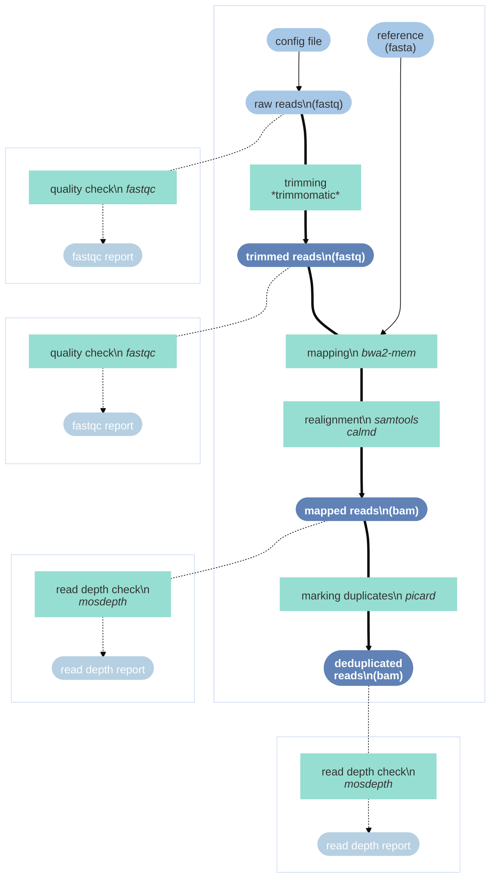

### Mapping step

```mermaid

%%{init: {"theme": "base",
  "htmlLabels": false }}%%

graph TB;

    classDef Output fill:#6082B6,stroke:#6082B6,stroke-width:2px,color:#fff;
    classDef Reports fill:#B6D0E2,stroke:#B6D0E2,stroke-width:2px,color:#fff;
    classDef Input fill:#A7C7E7,stroke:#A7C7E7,stroke-width:2px;
    classDef Process fill:#96DED1,stroke:#96DED1,stroke-width:2px;
    classDef Subgr fill:#FFFFFF,stroke:#FFFFFF;

    subgraph mapping
        A([config file]):::Input --> B(["`raw reads\n(fastq)`"]);
        B:::Input === D["trimming\n*trimmomatic*"];
        D:::Process ==> E(["`**trimmed reads\n(fastq)**`"]);
        E:::Output === G["`mapping\n*bwa2-mem*`"];
        G:::Process === G2["`realignment\n*samtools calmd*`"];
        F(["reference\n(fasta)"]):::Input -----> G;
        G2:::Process ==> K(["`**mapped reads\n(bam)**`"]);
        K:::Output === L["`marking duplicates\n*picard*`"];
        L:::Process ==> M(["`**deduplicated reads\n(bam)**`"]):::Output; 
    end
    
    subgraph fastqc1
        C["`quality check\n*fastqc*`"]:::Process -.-> I([fastqc report]):::Reports;
    end

    subgraph fastqc2
        H["`quality check\n*fastqc*`"]:::Process -.-> J([fastqc report]):::Reports;
    end

    subgraph depth1
        N["`read depth check\n*mosdepth*`"]:::Process -.-> O([read depth report]):::Reports;
    end

    subgraph depth2
        P["`read depth check\n*mosdepth*`"]:::Process -.-> R([read depth report]):::Reports;
    end
    
    classDef subg fill:#fff,color:#fff
    class mapping,fastqc1,fastqc2,depth1,depth2 subg


    B -.- C
    E -.- H
    K -.- N
    M -.- P
```
