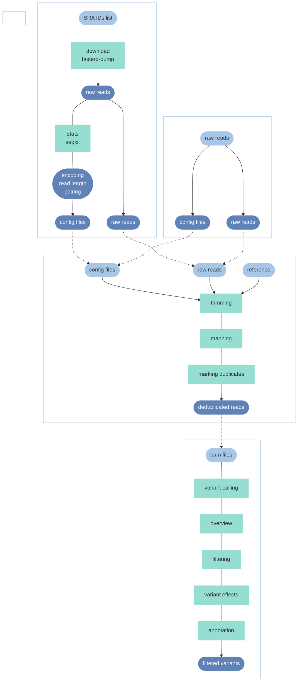

### Workflow overview

```mermaid
graph TB;

    classDef Output fill:#6082B6,stroke:#6082B6,stroke-width:2px,color:#fff;
    classDef Input fill:#A7C7E7,stroke:#A7C7E7,stroke-width:2px;
    classDef Process fill:#96DED1,stroke:#96DED1,stroke-width:2px;

    subgraph download
        direction TB;
        A([SRA IDs list]):::Input --- A2["download\nfasterq-dump"]:::Process;
        A2 --> B(["raw reads"]):::Output;
        B --- D["stats\nseqkit"];
        D:::Process --- E(["encoding\nread length\npairing"]);
        E:::Output --> G(["config files"]):::Output;
        B ----> B2(["raw reads"]):::Output;
    end

    subgraph genconf
        direction TB;
        C(["raw reads"]):::Input ---> I(["config files"]):::Output;
        C ---> C2(["raw reads"]):::Output
    end

    subgraph mapping
        direction TB;
        H(["config files"]):::Input --> J[trimming]:::Process;
        H2(["raw reads"]):::Input --> J[trimming]:::Process;
        H3(["reference"]):::Input --> J[trimming]:::Process;
        J --- K[mapping]:::Process;
        K --- L[marking duplicates]:::Process;
        L --> M(["deduplicated reads"]):::Output;
    end

    subgraph snps
        direction TB;
        SI([bam files]):::Input --- S1["variant calling"]:::Process;
        S1 --- S2["overview"]:::Process;
        S2 --- S3["filtering"]:::Process;
        S3 --- S4["variant effects"]:::Process;
        S4 --- S5["annotation"]:::Process;
        S5 --> S6(["filtered variants"]):::Output;
    end
    
    subgraph main
        direction TB;
        G -.-> H;
        I -.-> H;
        B2 -.-> H2;
        C2 -.-> H2;
        M -.-> SI;
    end
    
    classDef down fill:#fff,color:#fff,stroke:#A7C7E7
    class download,genconf,mapping,main,snps down

```
